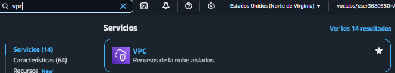

<h1>Instalación de Wordpress en instancia Debian(o Ubuntu) EC2 con soporte de base de datos RDS y EFS</h1>

<h2>Creamos la VPC</h2>

<ul>Lo Primero que vamos ha hacer dentro de nuestro labotario en AWS Buscar la opción de VPC.</ul>

<ul>Una vez dentro hacemos click sobre el boton de "<b>Crear VPC</b>".</ul>

<ul>Tras hacer click podremos configurar la máquina adaptandonos a los requisitos requeridos.</ul>

<ul>Tras completar los campos de los atributos de la VPC, hacemos click sobre el boton de "<b>Crear VPC</b>".</ul>

<ul>Ahora se estará creando la VPC, y podemos verla en  "<b>Ver VPC</b>".</ul>

<h2>Creamos la EC2</h2>

<ul>Vamos al buscador dentro de nuestro labotario en AWS Buscar la opción de EC2.</ul>

<ul>Tras marcar la opción de EC2, en el menu izquierdo hacemos click sobre <b>Instancias</b>.</ul>

<ul>Para lanzar la instancia pulsamos sobre el boton de <b>Lanzar Instacias</b>.</ul>

<ul>Ahora le pondremos un nombre y eligiremos el OS que será Ubuntu.</ul>

<ul>Tras finalizar la configuración, lo guardamos pulsando sobre el boton de <b>Lanzar Instacias</b>.</ul>

<ul>Nos permetirá ver todas las instancias si pulsamos el boton de <b>Ver todas las instancias</b>.</ul>

<ul>Seleccionamos la instancia que nos interese comprobamos si las IPs esten correctas.</ul>

<ul>Como hemos seleccionado la instancia que nos interese pulsamos el boton de "<b>Conectar</b>".</ul>

<ul>Tras pulsar nos saldra un menú en el cual podremos elegir la manera de como podremos tener la conexión.</ul>

<ul>Finalmente nos conectamos a la máquina.</ul>

