<h1>Instalación de Wordpress en instancia Debian(o Ubuntu) EC2 con soporte de base de datos RDS y EFS</h1>

<h2>Creamos la VPC</h2>

<ul>Lo Primero que vamos ha hacer dentro de nuestro labotario en AWS Buscar la opción de VPC.</ul>

<ul>Una vez dentro hacemos click sobre el boton de "<b>Crear VPC</b>".</ul>

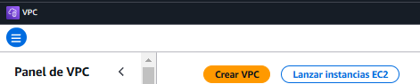

<ul>Tras hacer click podremos configurar la máquina adaptandonos a los requisitos requeridos.</ul>

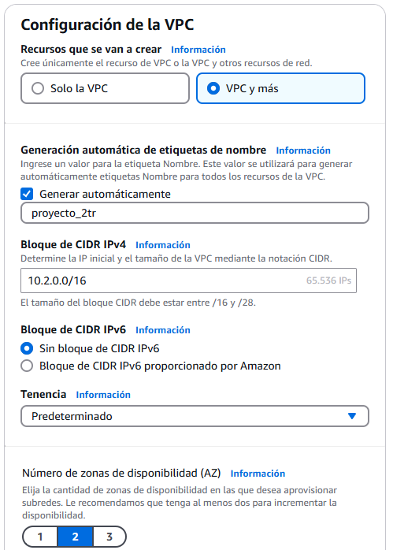

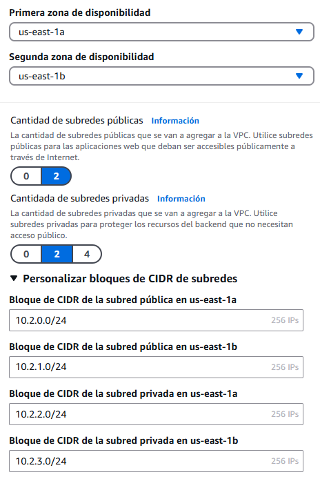

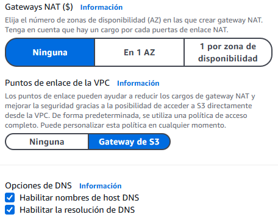

<ul>Tras completar los campos de los atributos de la VPC, hacemos click sobre el boton de "<b>Crear VPC</b>".</ul>

<ul>Ahora se estará creando la VPC, y podemos verla en  "<b>Ver VPC</b>".</ul>

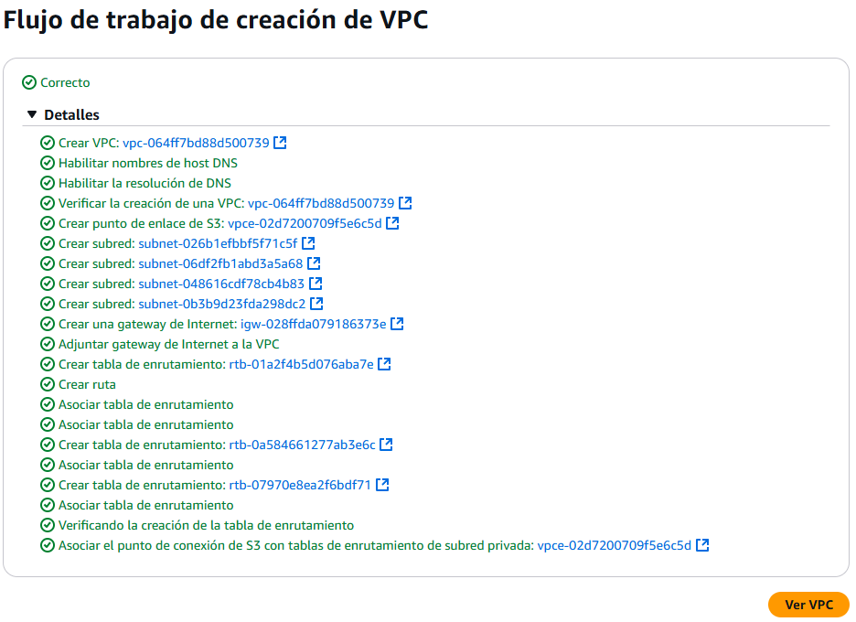

<h2>Creamos la EC2</h2>

<ul>Vamos al buscador dentro de nuestro labotario en AWS Buscar la opción de EC2.</ul>

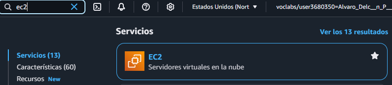

<ul>Tras marcar la opción de EC2, en el menu izquierdo hacemos click sobre <b>Instancias</b>.</ul>

<ul>Para lanzar la instancia pulsamos sobre el boton de <b>Lanzar Instacias</b>.</ul>

<ul>Ahora le pondremos un nombre y eligiremos el OS que será Ubuntu.</ul>

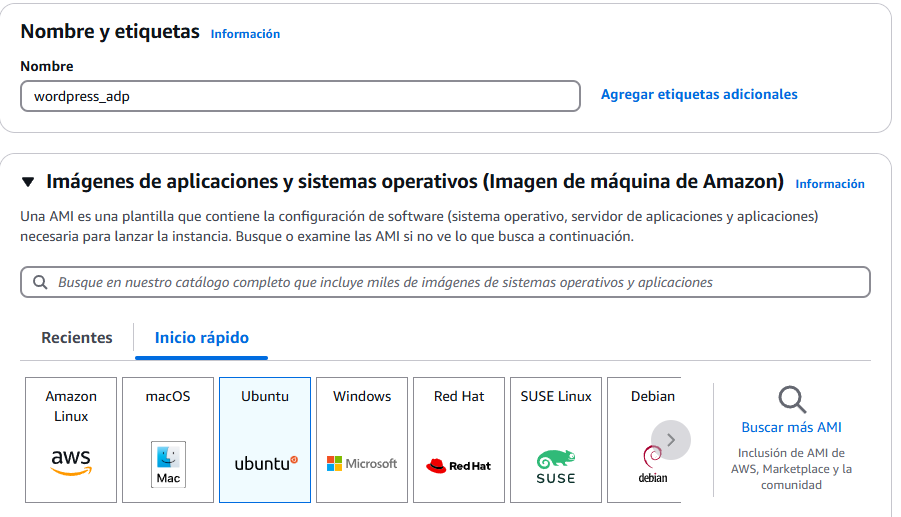

<ul>Tras finalizar la configuración, lo guardamos pulsando sobre el boton de <b>Lanzar Instacias</b>.</ul>

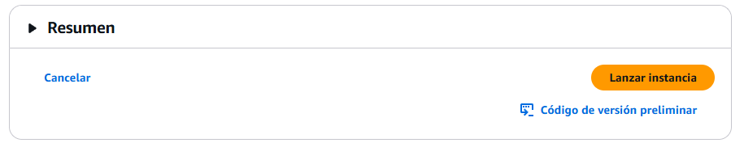

<ul>Nos permetirá ver todas las instancias si pulsamos el boton de <b>Ver todas las instancias</b>.</ul>

<ul>Seleccionamos la instancia que nos interese comprobamos si las IPs esten correctas.</ul>

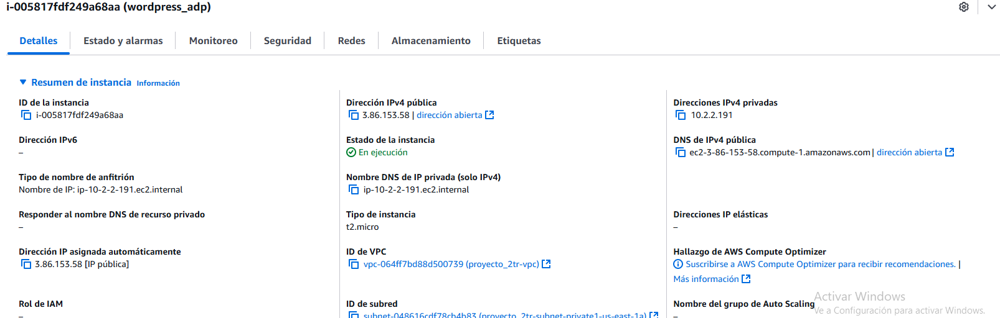

<ul>Como hemos seleccionado la instancia que nos interese pulsamos el boton de "<b>Conectar</b>".</ul>

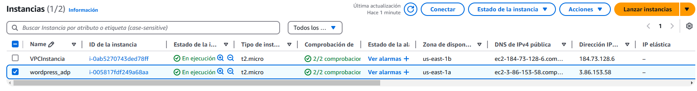

<ul>Tras pulsar nos saldra un menú en el cual podremos elegir la manera de como podremos tener la conexión.</ul>

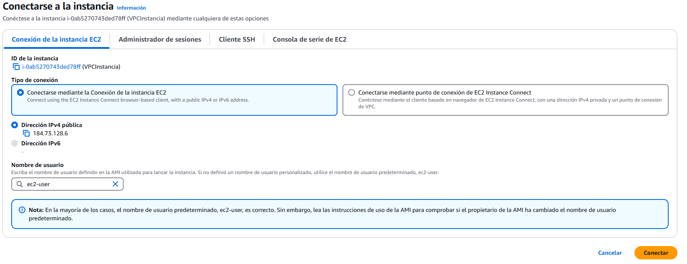

<ul>Finalmente nos conectamos a la máquina.</ul>

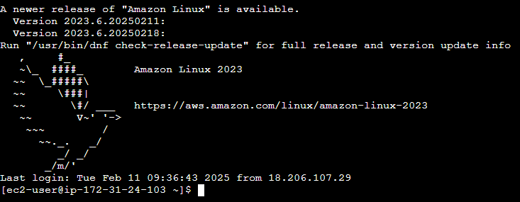

<h2>Instalación de Apache y PHP</h2>

<ul>Ahora instalaremos el servidor apache mediante los siguientes comandos.</ul>

    sudo apt update
    sudo apt install apache
    

<ul>Actualizamos nuestra máquina e instalamos apache.</ul>

<ul>Iniciamos apache y habilitamos para que incie siempre.</ul>

    sudo systemctl start apache2
    sudo systemctl enable apache2

<ul>Con el siguiente comando instalaremos como un módulo de Apache el php</ul>

    sudo apt -y update && sudo apt upgrade

<ul>Ahora comprobamos la versión de y que la instalación es correcta.</ul>

    php -v

<ul>Tambien necesitamos un modulo de apache  para la bsae de datos en este caso usaremos MySQL.</ul>

    sudo apt install php-mysql

<ul>Tras añadir la base de datos reiniciamos apache</ul>

    sudo systemctl restart apache2

<h2>Creación de Base de Datos</h2>

<ul>Vamos ha hacer dentro de nuestro labotario en AWS Buscar la opción de RDS.</ul>

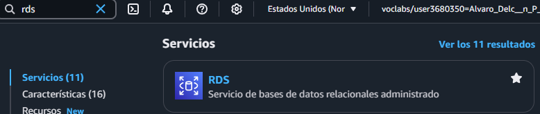

<ul>Le damos al botónde "<b>Crear base de datos</b>"</ul>

<ul>Vamos ha configuramos la base de datos.</ul>

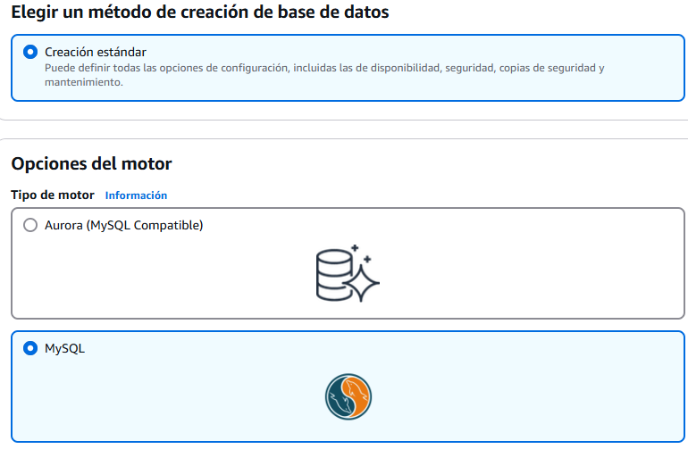

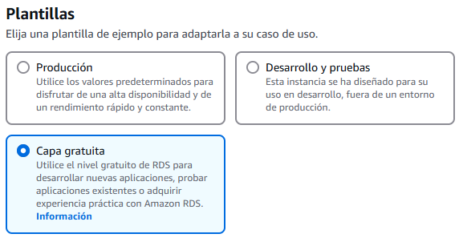

<ul>Introducimos un nombre a la base de datos, una credenciales y contraseña.</ul>

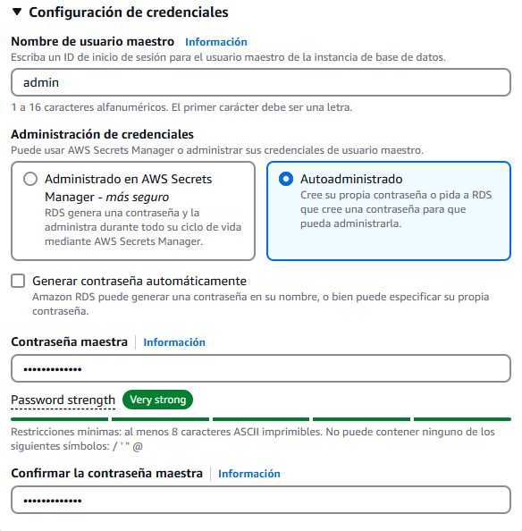

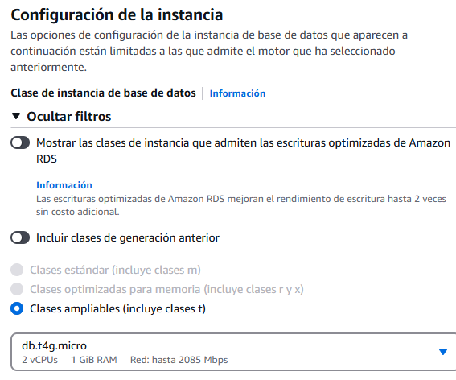

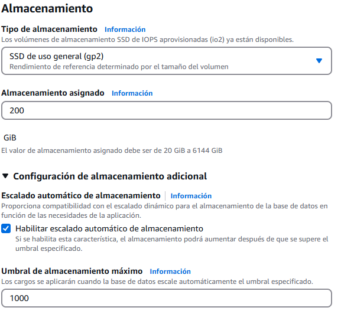

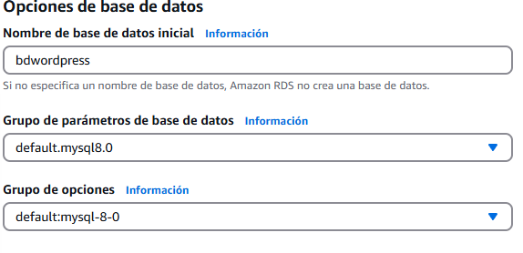

<ul>Una vez todo configurado, creamos la base de datos.</ul>

<ul>Ahora configuramos la conexión a la base de datos con una configuración insegura para un proyecto de una empresa pero este proyecto servirá.</ul>

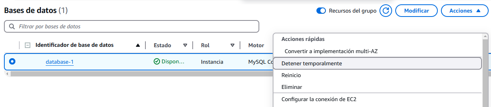

<ul>La configuración de conexión de EC2.</ul>

<ul>Seleccionamos la instancia EC2 que nos interese.</ul>

<h2>Elastic File System</h2>

<ul>Vamos a hacer dentro de nuestro labotario en AWS Buscar la opción de EFS.</ul>

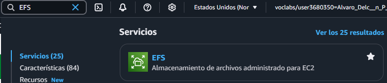

<ul>Hacemos click sobre el btón de <b>Crear un sistemas de archivos</b></ul>

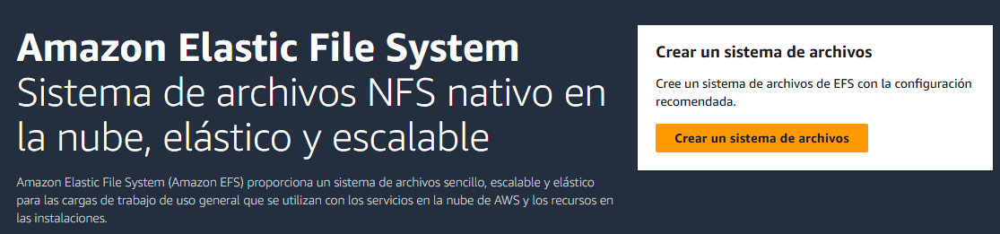

<ul>Le pondremos un nombre y elegimos la VPC de la práctica</ul>

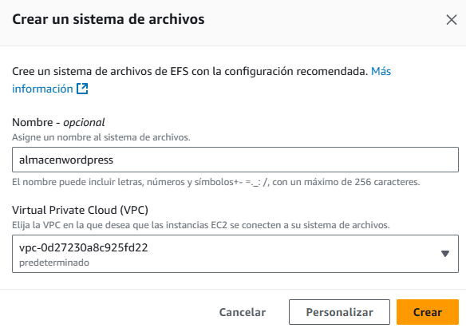

<ul>Confirmamos que se haya creado</ul>

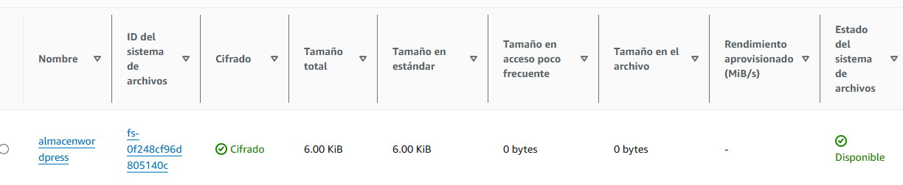

<ul>Asociamos la EFS a nuestra instancia y haciendo clic en "Asociar"</ul>

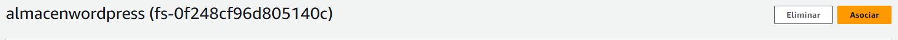

<ul>Nos explica como poder conectarse y elegimos la segunda opción</ul>

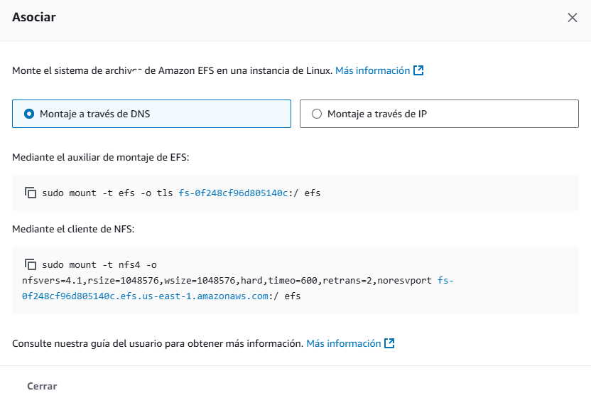

<ul>Antes de ejecutar el comando proporcionado crearemos la carpeta "efs".</ul>

    sudo mkdir efs
    
<ul>Después de crear la carpeta "efs" ejecutamos el comando de creación del paquete nfs-common</ul>

    apt-get install nfs common

<h2>Instalación de Wordpress</h2>

<ul>Accedemos al directorio /var/www/html y ejecutamos el siguiente comando para poder descargar wordpress</ul>

    sudo wget https://wordpress.org/latest.tar.gz

<ul>Para descomprimirlo</ul>

    sudo tar -xf latest.tar.gz
    
<ul>Ahora la carpeta de wordpress esta descomprimida y tenenmos que crear unas credenciales, con las cuales nos conectaremos a la instancia de la base de datos mediante el punto de acceso de nuestra propia base de datos y poniendo nuestra contraseña</ul>

    sudo apt install default-mysql-client
    sudo mysql -u admin -h database-1.c1xhozphuei9.us-east-1.rds.amazonaws.com -p

<ul>Creamos la base de datos y el usuario</ul>

    CREATE DATABASE wordpress; 
    CREATE USER 'usuario' IDENTIFIED BY 'usuario'; 
    GRANT ALL PRIVILEGES ON wordpress.* TO 'usuario'; 
    FLUSH PRIVILEGES;

<ul>Ahora buscamos la nuestra IP publica mas /wordpress nos aparecerá esto.</ul>

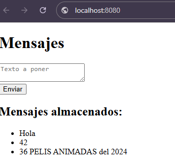

<ul>Le damos al botón que pone "<b>Let's go</b>" y rellenamos los campos requeridos.</ul>

