<h1>Actividad 1</h1>

<h1>Instalación de Docker en Ubuntu</h1>

El primer paso es eliminar cualquier versión anterior de Docker. Como estamos trabajando en una máquina recién creada, es probable que no haya ninguna instalación previa, pero ejecutamos el siguiente comando para asegurarnos:

    sudo apt-get remove docker docker-engine docker.io containerd runc

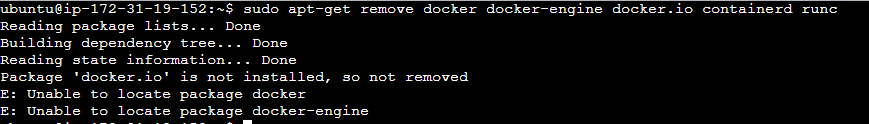

<h3>Actualización del sistema</h3>

Ejecutamos el siguiente comando para actualizar la máquina:

    sudo apt-get update

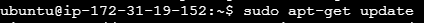

<h3>Instalación de Docker</h3>

Ejecutamos los siguientes comandos para instalar Docker:

    curl -fsSL https://download.docker.com/linux/ubuntu/gpg | sudo apt-key add -
    sudo add-apt-repository "deb [arch=amd64] https://download.docker.com/linux/ubuntu (lsb_release -cs) stable"

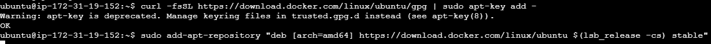

Ahora instalamos la última versión de Docker CE:

    sudo apt-get update
    sudo apt-get install docker-ce docker-ce-cli containerd.io

El servicio de Docker se inicia automáticamente después de la instalación y se ejecutará en cada reinicio del sistema. Para comprobar su estado, usamos:

    sudo systemctl status docker 

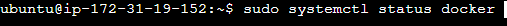

Con esto, Docker está correctamente instalado en Ubuntu.

<h1>Actividad 2</h1>

<h2>Pruebas iniciales con Docker</h2>

<h3>Ejecutar la imagen "hello-world"</h3>

Para verificar que Docker funciona correctamente, ejecutamos:

    sudo docker run hello-world

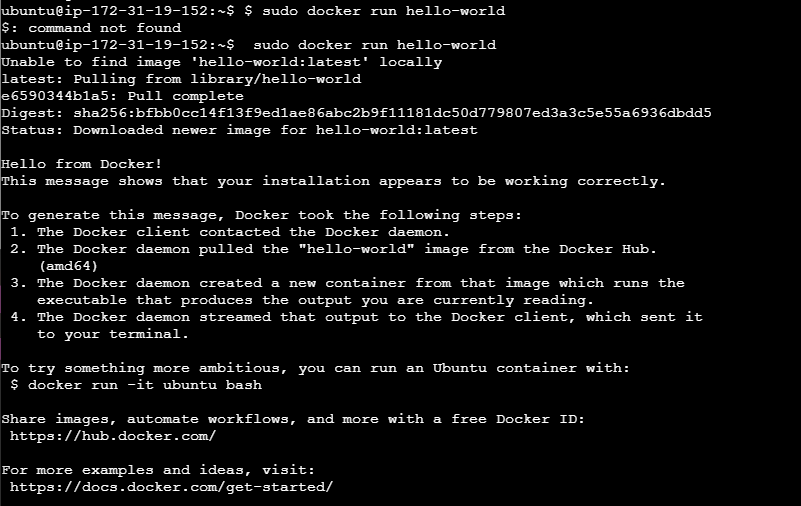

<h3>Mostrar las imágenes de Docker instaladas</h3>

Ejecutamos el siguiente comando para listar las imágenes instaladas:

    sudo docker images

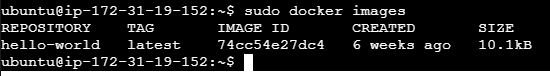

<h3>Listar los contenedores de Docker</h3>

Para ver los contenedores en nuestro sistema, incluyendo los detenidos, usamos:

    sudo docker ps -a

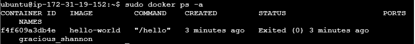

Lleva a cabo la práctica descrita en el segundo artículo

Edita el fichero Dockerfile

Para crear el fichero primero tenemos que bajarnos el código de la aplicación con la que vamos a trabajar el Dockerfile. Para ello clonamos el repositorio con el que trabajaremos de la siguiente manera:

    sudo git clone https://github.com/docker/getting-started-app.git

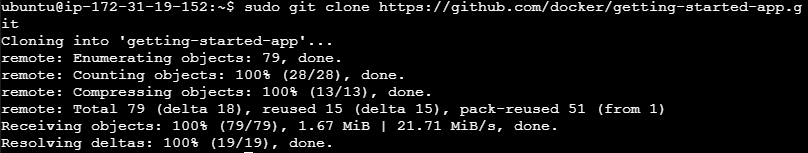

Verificamos el contenido del repositorio clonado:

    ls getting-started-app/

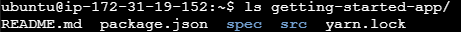

Nos ubicamos dentro de la carpeta clonada y creamos el archivo Dockerfile:

    cd getting-started-app
    sudo nano Dockerfile

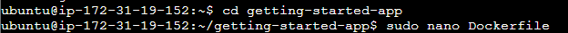

Añadimos el siguiente contenido:

    # syntax=docker/dockerfile:1
    FROM node:lts-alpine
    WORKDIR /app
    COPY . .
    RUN yarn install --production
    CMD ["node", "src/index.js"]
    EXPOSE 3000

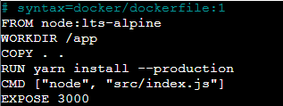

Construcción del contenedor

Ejecutamos el siguiente comando para construir la imagen a partir del Dockerfile

    sudo docker build -t getting-started .

Ejecución del contenedor

sudo docker run -d -p 127.0.0.1:3000:3000 getting-started

Podemos ver ejecutando el comando bien a y el contenedor que está funcionando en la dirección 127.0.0.1:3000:

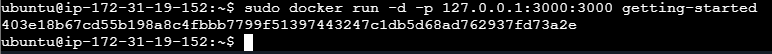

Create una cuenta en hub.docker.com

Accederemos a la página docker.com y nos hacemos una cuenta: 

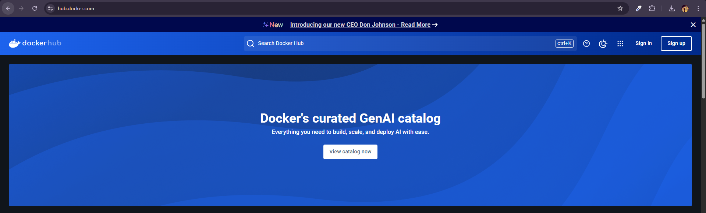
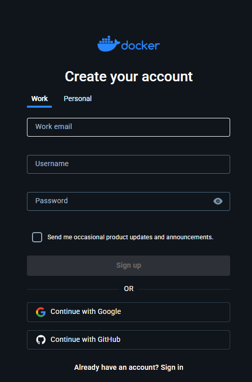
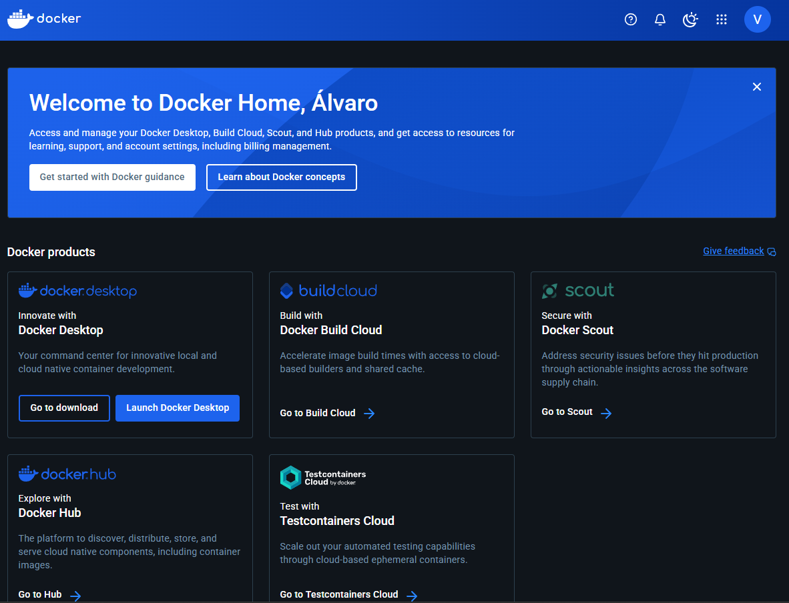

