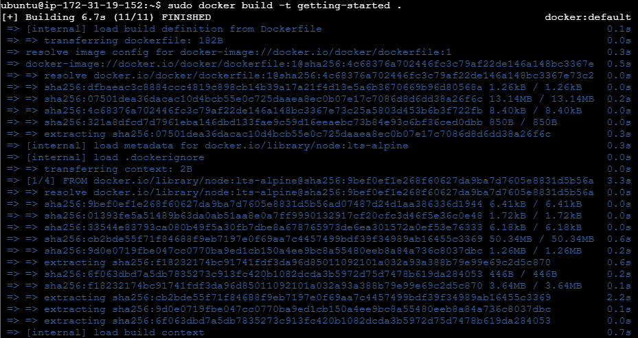

<h1>Actividad 1</h1>

<h1>Instalación de Docker en Ubuntu</h1>

El primer paso es eliminar cualquier versión anterior de Docker. Como estamos trabajando en una máquina recién creada, es probable que no haya ninguna instalación previa, pero ejecutamos el siguiente comando para asegurarnos:

    sudo apt-get remove docker docker-engine docker.io containerd runc

<h3>Actualización del sistema</h3>

Ejecutamos el siguiente comando para actualizar la máquina:

    sudo apt-get update

<h3>Instalación de Docker</h3>

Ejecutamos los siguientes comandos para instalar Docker:

    curl -fsSL https://download.docker.com/linux/ubuntu/gpg | sudo apt-key add -
    sudo add-apt-repository "deb [arch=amd64] https://download.docker.com/linux/ubuntu (lsb_release -cs) stable"

Ahora instalamos la última versión de Docker CE:

    sudo apt-get update
    sudo apt-get install docker-ce docker-ce-cli containerd.io

El servicio de Docker se inicia automáticamente después de la instalación y se ejecutará en cada reinicio del sistema. Para comprobar su estado, usamos:

    sudo systemctl status docker 

Con esto, Docker está correctamente instalado en Ubuntu.

<h1>Instalación de Docker</h1>

<h1>Actividad 2</h1>

<h2>Pruebas iniciales con Docker</h2>

<h3>Ejecutar la imagen "hello-world"</h3>

Para verificar que Docker funciona correctamente, ejecutamos:

    sudo docker run hello-world

<h3>Mostrar las imágenes de Docker instaladas</h3>

Ejecutamos el siguiente comando para listar las imágenes instaladas:

    sudo docker images

<h3>Listar los contenedores de Docker</h3>

Para ver los contenedores en nuestro sistema, incluyendo los detenidos, usamos:

    sudo docker ps -a

Lleva a cabo la práctica descrita en el segundo artículo

Edita el fichero Dockerfile

Para crear el fichero primero tenemos que bajarnos el código de la aplicación con la que vamos a trabajar el Dockerfile. Para ello clonamos el repositorio con el que trabajaremos de la siguiente manera:

    sudo git clone https://github.com/docker/getting-started-app.git

Verificamos el contenido del repositorio clonado:

    ls getting-started-app/

Nos ubicamos dentro de la carpeta clonada y creamos el archivo Dockerfile:

    cd getting-started-app
    sudo nano Dockerfile

Añadimos el siguiente contenido:

    # syntax=docker/dockerfile:1
    FROM node:lts-alpine
    WORKDIR /app
    COPY . .
    RUN yarn install --production
    CMD ["node", "src/index.js"]
    EXPOSE 3000

Construcción del contenedor

Ejecutamos el siguiente comando para construir la imagen a partir del Dockerfile

    sudo docker build -t getting-started .

Ejecución del contenedor

    sudo docker run -d -p 127.0.0.1:3000:3000 getting-started

Podemos ver ejecutando el comando bien a y el contenedor que está funcionando en la dirección 127.0.0.1:3000:

Create una cuenta en hub.docker.com

Accederemos a la página docker.com y nos hacemos una cuenta: 

Nos logueamos con el comando docker login para iniciar sesión con nuestra cuenta desde la máduina virtual.

Para publicar nuestro contenedor usaremos el comando docker tag con los siguientes parámetros para que el nombre de la subida sea aceptada en el registro público:

    sudo docker tag getting-started varocode48/getting-started:v1
    sudo docker push varocode48/getting-started:v1

Tras esto se habra subido el contenedor.

<h1>Actividad 3</h1>

<h1>Descarga la imagen de ubuntu, hello-world y nginx</h1>

Descargamos las imágenes ejecutando los siguientes comandos:

    sudo docker pull ubuntu

    sudo docker pull hello-world

    sudo docker pull nginx

Mostramos el listado las imágenes

    docker images

Ejecutamos un contenedor llamado hello-world y le damos el nombre “myhello1”, “myhello2” y “myhello3”

    docker run --name myhello1 hello-world

    docker run --name myhello2 hello-world

    docker run --name myhello3 hello-world

Mostramos los contenedores que estan funcionando

    docker ps -a 

Para detener el contenedor "myhello1”, "myhello2” lo detenerlo mediante el siguiente comando:

    docker stop myhello1
    
    docker stop myhello2

Borra el contenedor “myhello1”

    docker rm myhello1
    

Para ver si se ha eliminado aplicamos el siguientes código para ver que se están ejecutando.

    docker ps -a

Borramos todos los contenedores:

    docker rm $(docker ps -aq)

Todos los contenedores han sido eliminados.

<h1>Actividad 4</h1>

<h2>Ejemplo 1: Despliegue de la aplicación Guestbook</h2>

<h3>Seguiremos la siguiente ejemplo : https://github.com/josedom24/curso_docker_ies/blob/main/modulo3/guestbook.md de 
josedom24</h3>

Comenzamos la práctica creando una red docker

    docker network create red_guestbook

Usaremos Redis como base de datos,

    docker run -d --name db --network my_network redis

Como no tengo alguna imagen en Redis,se crea

Creamos un nuevo directorio llamada guestbook

Creamos un archivo llamado app.py

    mkdir guestbook && cd guestbook
    nano app.py

También creamos un archivo Dockerfile con este contenido

Por último, un archivo requirements.txt donde escribimos lo siguiente

Construir la imagen para el frontend

    docker build -t my_guestbook .

Ejecutamos el contenedor

    docker run -d –name -web --my_network -p 8080:5000 my_guestbook

Accedemos a localhost:8080 para comprobar su funcionamiento

<h2>Ejemplo 2: Despliegue de la aplicación Temperaturas</h2>

    docker network create temperatura_app

<h6>He tenido problemas y no tengo las imágenes</h6>

Creammos un archivo llamado nubes.js para darle contenido a la aplicación

Creamos un archivo Dockerfile y jason para las dependencias.

Construimos el backend con:

    docker built -t backend_temp
    
Creamos una carpeta llamada eltiempo

    mkdir eltiempo
    cd eltiempo
    
Y creamos el archivo app.py, el archivo requirements.txt y Dockerfile

Construimos la imagen:

    docker built -t climna
    
Ejecutamos el contenedor del frontend en nuestra red
    
    docker run -d --name eltiempo -p 8080:5000 climna
 

